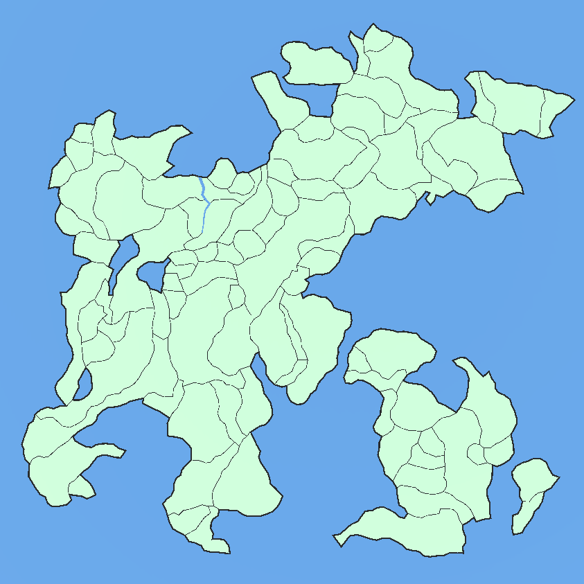
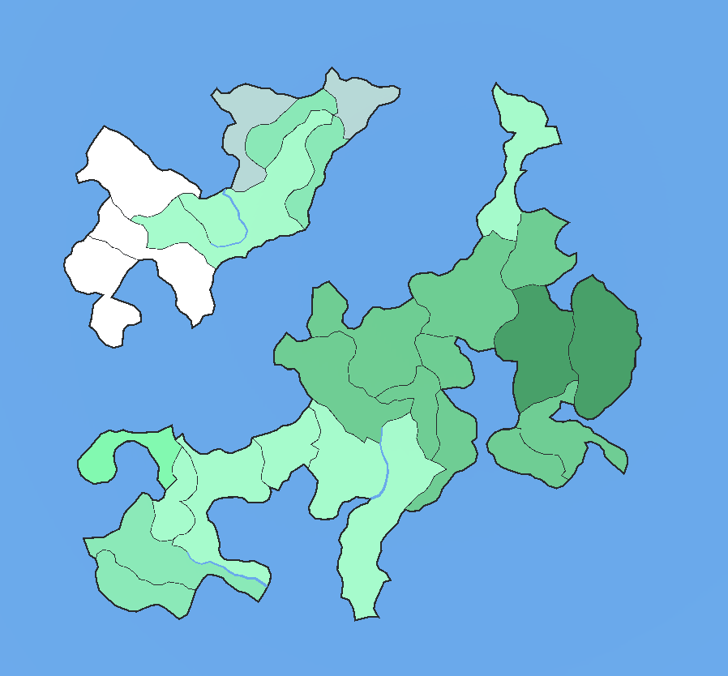
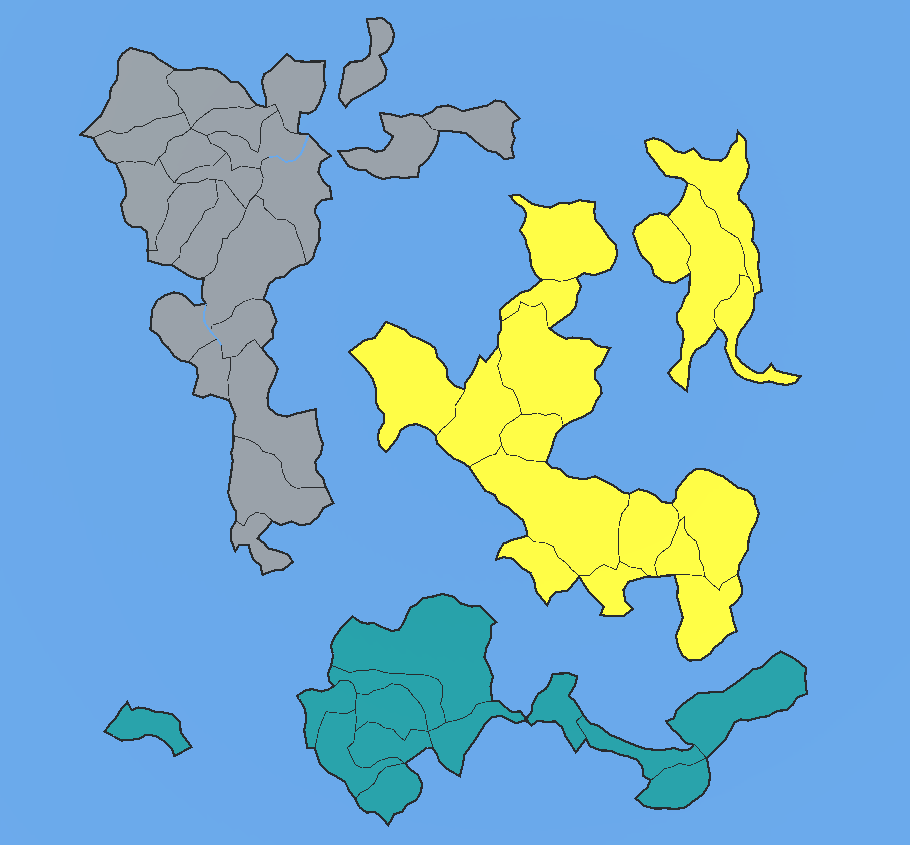
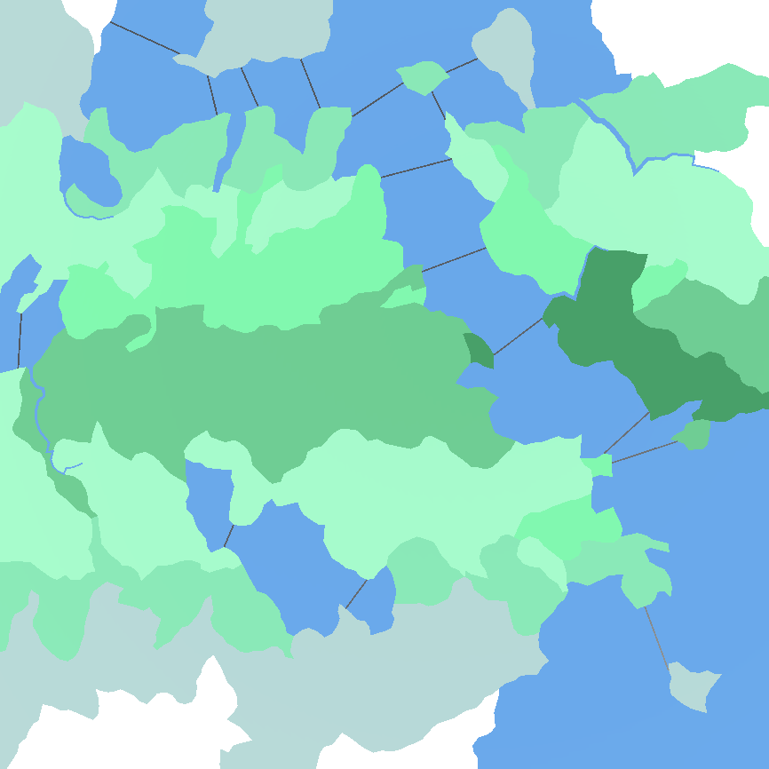
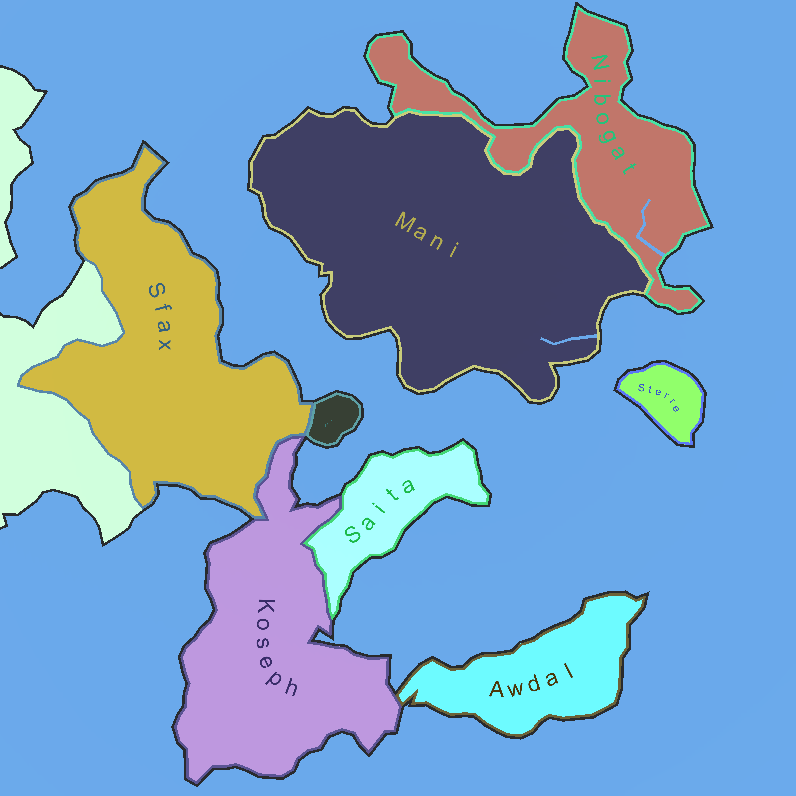
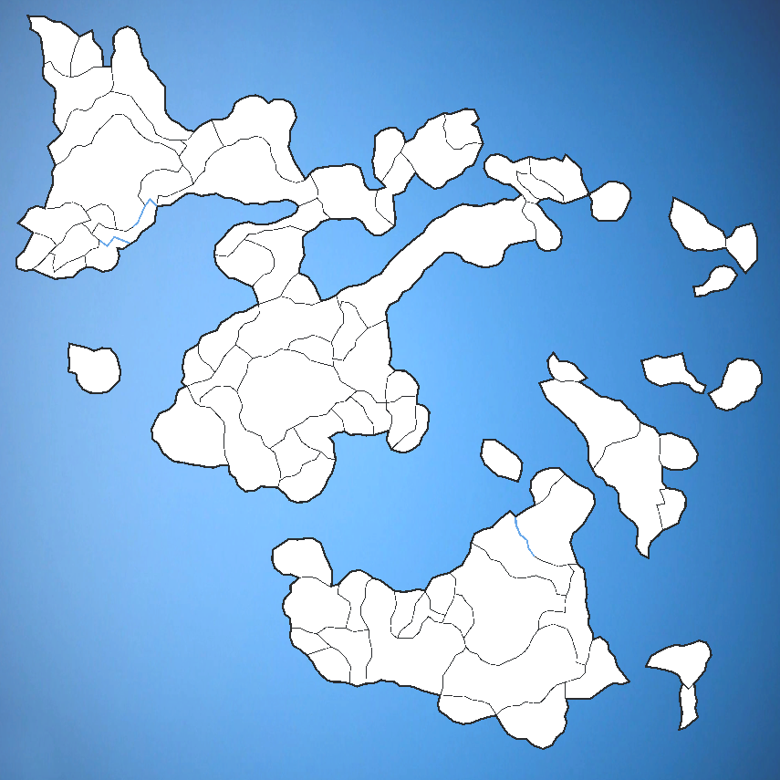

# About
A Unity project that creates 2d polygonial maps. What this means is that according to specified parameters, it will return a map that is splitted into random polygonial regions and continents. Using this generator, the project also includes some games and simulations using that generator. Each of the main projects contains its own scene in Unity. A small explanation for the main projects can be found in the chapters below.

# Map Editor
The map editor can be used to create the maps and try different parameters. The following screenshots show some features of the map editor.
 

    

        *basic FractalNoise map*
         
        
    

    

        *FractalNoise map showing biomes*
         
        
    

    

        *Island map showing continents*
         
        
    

        

        *regional map with water connections*
         
        
    

    

        *Dynamic polygon labels*
         
        
    

    

        *Parrisk map*
         
        
    

# Levers of Democracy (ElectionTactics)
Levers of Democracy (working title: ElectionTactisc) is a strategy game where each player controls a party in a randomly generated nations. Try to win elections in as many districts as possible to be the most successful party in the nation. Each district has unique personalities and every choice will matter.

# Parrisk
Parrisk is a game where you have to conquer all areas of a procedurally generated map. Each region contains an amount of unit and all players plan the movement of their units for the next turn at the same time.

# GeoPolSim
GeoPolSim (Geopolitical Simulator) is a project aiming to simulate a map view of a generated world over the course of history. See nations emerge, collapse, internal and external conflicts, disasters, unions and follow the fate of the world.

